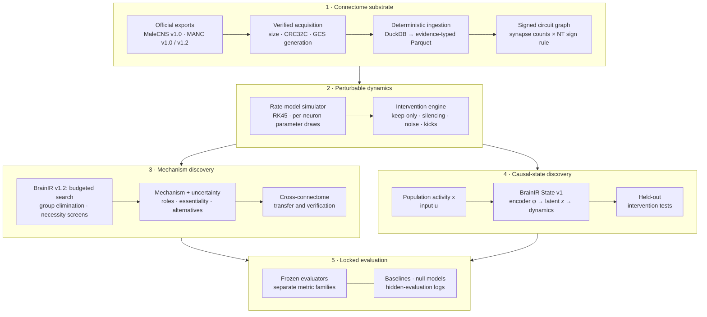
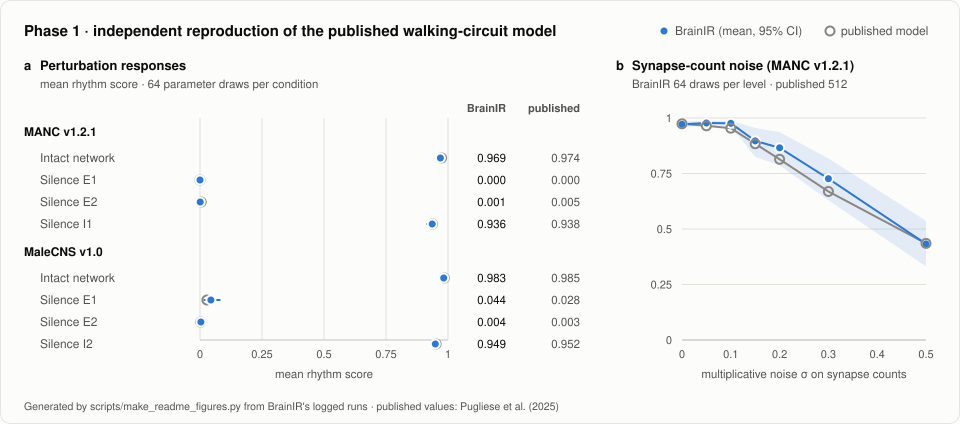
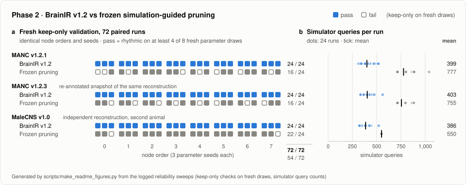

# BrainIR

**Reverse-engineering neural computation from connectome-scale wiring through perturbation-tested causal mechanism discovery.**

BrainIR is a computational neuroscience system for turning connectome-scale neural wiring into testable mechanistic
hypotheses. It combines deterministic connectome reconstruction, an independently implemented neural-dynamics simulator,
budgeted causal search, intervention testing, cross-connectome evaluation and locked benchmark infrastructure to identify
compact neural mechanisms that preserve modelled behaviour. The research program runs from exact circuit reconstruction,
through perturbation-guided mechanism discovery, to latent causal-state discovery. Its testbed is the descending-neuron-driven
walking rhythm of *Drosophila*, simulated on the MaleCNS and MANC connectomes.

## Results at a glance

| Result | BrainIR | Reference |
|:--|--:|--:|
| Published MANC front-leg connectivity pairs reproduced with identical synapse counts | **196,535&nbsp;/&nbsp;196,535** | published matrix |
| Published full-VNC connectivity pairs reproduced with identical synapse counts | **1,372,404&nbsp;/&nbsp;1,372,404** | published matrix |
| Mean rhythm score of the DNg100-stimulated MANC network, 1,024 parameter draws | **0.973** | 0.974 (published) |
| Rhythmic trials in the same experiment | **99.7 %** | 99.8 % (published) |
| Published silencing effects reproduced within 0.02 mean score, two connectomes | **8 / 8** | published model |
| Discovered mechanisms that pass fresh keep-only validation | **72 / 72** | 54 / 72 † |
| Simulator queries per discovery run, three network builds | **399 · 386 · 403** | 777 · 550 · 755 † |
| Transferred mechanisms still sufficient in a second fly's connectome | **5 / 6** | 0 / 120 ‡ |

<sub>† Frozen simulation-guided pruning baseline, run on identical node orders and parameter seeds.
‡ Size- and sign-matched random interneuron sets.</sub>

**Substrate:** 166,700 neurons and 25.6 M connections (MaleCNS v1.0) · 311.8 M synapses conservation-checked · four
deterministic dataset builds · 23.7 GB of checksum-pinned source data · nine git tags marking frozen benchmark and method states.

## System overview



Discovery methods see each circuit only through a blinded bundle and a query-budgeted simulator. Every claim they make is
scored by a frozen evaluator against baselines, null models and hidden references.

## Research contributions

### Verified neural substrate

BrainIR rebuilds MaleCNS v1.0 and three MANC builds from the official exports, reproduces the published walking-circuit
matrices pair for pair, and matches the published dynamics with an independently implemented simulator.

### Mechanism discovery

BrainIR v1.2 recovers compact, intervention-verified mechanisms from anonymised wiring under a fixed simulator budget, with
enumerated alternatives and calibrated uncertainty. Its mechanisms passed fresh functional validation in 72 of 72 runs.

### Causal-state discovery

BrainIR State v1 learns low-dimensional latent dynamics and tests them against held-out interventions, separating a
predictive state from a causal one.

### Research infrastructure

Blinded, hash-locked benchmarks, method locks before any hidden evaluation, budgeted simulators, null models, clean-room
execution and sha256-committed hidden test data.

## Phase 1 — reconstructing the neural substrate

| Measurement | Reference | BrainIR |
|:--|--:|--:|
| MANC front-leg connectivity: pairs with identical synapse counts | 196,535 | **196,535** |
| MANC full-VNC connectivity: pairs with identical synapse counts | 1,372,404 | **1,372,404** |
| MaleCNS front-leg connectivity, bodies unchanged since the published extraction | 116,424 | **116,424** |
| Mean rhythm score, 1,024 parameter draws | 0.974 | **0.973** |
| Median rhythm score | 0.999 | **0.999** |
| Rhythmic fraction (score ≥ 0.5) | 0.998 | **0.997** |
| Median active front-leg motor neurons (range) | 3 (0–6) | **3 (0–5)** |
| Published silencing effects in two connectomes | 8 conditions | **all within 0.02** |
| Strongest walking-rhythm driver among 933 descending neurons | DNg100, ranks 1–2 | **DNg100, ranks 1–2** |

<p align="center">
  <picture>
    <source media="(prefers-color-scheme: dark)" srcset="docs/figures/phase1_reproduction_dark.svg">
    
  </picture>
</p>

BrainIR rebuilds these circuits from the official exports instead of importing a pre-built adjacency matrix. Every source
object is pinned by size, CRC32C, MD5 and GCS generation. No bulk export exists for MANC v1.2.x, so both annotation snapshots
are rebuilt from the raw synapse-partner table under a counting rule inferred from the v1.0 export (PSD confidence ≥ 0.4,
compared in float64). The rule reproduces the snapshot's per-neuron synapse totals for all 23,665 neurons. Ingestion runs
DuckDB over Arrow with about 70 validation checks per build, including exact conservation of all 311.8 M MaleCNS synapses,
and every rebuild is byte-identical. Each column carries an explicit evidence kind: EM observation, curated annotation, ML
prediction, rule-based hypothesis or model parameter.

The simulator is an independent float64 implementation of the published threshold-linear-tanh rate model:

```math
\tau_i \frac{dr_i}{dt} = \left[\, r^{\max}_i \tanh\!\left(\frac{a_i}{r^{\max}_i}\Big(I_i(t) + b\sum_j W_{ij}\, r_j - \theta_i\Big)\right)\right]_{+} - r_i
```

$`W`$ is the signed synapse-count matrix, and the per-neuron parameters are drawn from truncated normals and size-scaled.
Adaptive RK45 integration is split at stimulus discontinuities, and rhythm decisions are identical under RK45, DOP853 and
fixed-step RK4. The rhythm depends on this exact wiring: degree-preserving rewiring, sign shuffling and synapse-count
permutation each reduce rhythmic trials from 100 % to 0 % (8 draws each).

## BrainIR v1.2 — perturbation-guided mechanism discovery

**Input:** a blinded circuit in which interneuron types are salted tokens and neuron ids a salted permutation, the stimulus
and readout definitions, the rate model, and a simulator with a hard budget of 1,000 queries per network. **Output:** a
mechanism with roles, essentiality claims, posterior inclusion probabilities, enumerated alternative sufficient sets, a
minimality certificate, a predicted frequency and verified cross-connectome correspondences, in a frozen prediction schema.

```math
\pi(S) = \Pr_{\theta}\!\left[\mathrm{pass}\big(\mathrm{keep}(S)\big) \,\middle|\, \mathrm{pass}(\mathrm{intact})\right],
\qquad
\sigma(A) = \Pr_{\theta}\!\left[\mathrm{pass}\big(\mathrm{sil}(A)\big) \,\middle|\, \mathrm{pass}(\mathrm{intact})\right]
```

Here $`\theta`$ is a per-neuron parameter draw, `keep(S)` retains only $`S`$ with the stimulus and readout, and `sil(A)`
silences $`A`$ in the intact network. A set is sufficient when $`\pi(S) > 1/2`$ and 1-minimal when no member can be dropped;
a neuron is essential when $`\sigma(\{x\}) < 1/2`$. Rates are estimated sequentially from $`\mathrm{Beta}(1+k,\,1+n-k)`$
posteriors, and each decision waits until its posterior is decisive.

| Stage | Mechanism |
|:--|:--|
| Exact restriction | Keep neurons reachable from the stimulus through excitatory paths that also reach the readout; drop the silent ones as one verified group |
| Permutation-equivariant ordering | A structural relevance score fixes a canonical candidate order: deterministic given the seed, invariant to node order up to graph automorphisms |
| Adaptive group elimination | Remove candidate groups through keep-only interventions (bisection, activity queue, 1-minimality rounds); each decision is a sequential majority over parameter draws |
| Masking-aware necessity testing | Silence every member in the intact network; screen non-members so inhibitory masking cannot hide an essential neuron (flagged gates alone, the rest in two independent partitions) |
| Alternative-mechanism enumeration | Enumerate disjoint and replacement sufficient sets deterministically and necessity-test their members |
| Admissibility-first selection | Admit only validated, participating, faithful candidates; rank them by the intact network's reliance, then parsimony, then robustness, with a tie band for threshold-sensitive decisions |
| Calibrated uncertainty | Evidence-count inclusion probabilities, a minimality certificate, final fidelity on reserved draws, and a degeneracy flag when no compact mechanism exists |

No dataset name, neuron id, cell type or mechanism size appears in the method, and static tests enforce this. The
specification is the module docstring of [`src/brainir/methods/brainir_v1.py`](src/brainir/methods/brainir_v1.py).

### Functional reliability on the real networks

Both methods ran the same 8 node orders × 3 parameter seeds per network build with 1,000 queries. A mechanism passes when
its keep-only simulation is rhythmic on at least 4 of 8 fresh draws from a seed range that discovery cannot query.

| Network build | BrainIR v1.2 | Frozen pruning | BrainIR queries | Frozen pruning queries |
|:--|--:|--:|--:|--:|
| MANC v1.2.1 | **24 / 24** | 16 / 24 | **399** | 777 |
| MANC v1.2.3 ¹ | **24 / 24** | 16 / 24 | **403** | 755 |
| MaleCNS v1.0 | **24 / 24** | 22 / 24 | **386** | 550 |
| **All runs** | **72 / 72** | **54 / 72** | | |

<sub>¹ A re-annotated snapshot of the same MANC reconstruction as v1.2.1, with an independently salted node order.</sub>

BrainIR returned a sufficient mechanism in every run, rhythmic on at least 7 of 8 fresh draws each time, with 1.4–1.9× fewer
simulator queries. Its answers were also more stable across orders and seeds: pairwise Jaccard 0.80 against 0.63 and 0.85
against 0.65 on the MANC builds, and 1.00 against 0.87 on MaleCNS.

<p align="center">
  <picture>
    <source media="(prefers-color-scheme: dark)" srcset="docs/figures/phase2_reliability_dark.svg">
    
  </picture>
</p>

> **Performance note.** Query count is the budgeted cost the method controls. Each BrainIR query simulates the full 2-s
> protocol (the baseline's simulate 1 s) and many are full-network necessity tests, so simulated time is equal or higher and
> wall-clock time is longer.

**Hidden evaluation.** Scored once against the hidden reference after the method lock, BrainIR met the structural-recovery
criterion in 65 of 72 runs against 54 of 72, and more often on every build. Its single pre-registered blind run, committed
before the evaluator ran, recovered the published mechanism exactly on two builds. On the third it returned a different valid
mechanism with four neurons, every necessity claim confirmed: neuron-level mechanisms here are not unique.

**Synthetic confirmation, adversarial traps and invariance.** On 57 unseen synthetic mechanisms (10 families, 50–3,000
neurons, used once), BrainIR met the structural, intact-network and causal-functional criteria in all 342 runs. Six
adversarial trap families target confident errors: latent backups behind inhibitory gates, masked essential gates,
distributed drives, mechanisms that work on only some parameter draws, gated decoys and fragile-versus-robust
implementations. On them BrainIR was correct in 0.98 of 396 runs with a 0.01 confident-wrong rate, against 0.72 and 0.20 for
the strongest comparator. Ablating its masking-aware necessity screen costs 0.36 in correctness (95 % CI 0.24–0.47). These
tests use fresh seeds from the same generator family used during development. Under five nuisance transforms (edge reordering,
token re-salting, stripped annotations, sink distractors, doubled parameter spread) it returned the identical mechanism on
47 of 47 instances.

## Cross-connectome functional transfer

MaleCNS and MANC are reconstructions of two different flies. BrainIR carries a discovered mechanism into the other connectome
and re-tests it in the destination dynamics. It computes the correspondence itself from blind-tier evidence: synaptic
fingerprints against labelled descending, motor and sensory anchor neurons, plus hemilineage, neuromere, side and sign. The
curated cross-dataset matches are not used.

| Direction | Destination sufficient | Destination queries | Matched random sets sufficient |
|:--|--:|--:|--:|
| MaleCNS → MANC | **3 / 3** | 2 | 0 / 60 |
| MANC → MaleCNS | **2 / 3** | 2 + 21 for adaptation | 0 / 60 |

Independent discovery in the destination costs 359–406 queries; transfer costs 2–23, and its result agrees with independent
discovery at Jaccard 0.80. Carried through the curated mapping instead, the published circuits drive the rhythm in 64 of 64
draws in both directions, against 0 of 64 for sign-matched random triples.

> Transfer establishes functional sufficiency in a second animal's wiring, not neuron identity.

## Phase 3 — from circuit identity to causal state

Neuron-level mechanisms are not unique, so Phase 3 moves the target above neuron identity:

> Can the circuit be compressed into a low-dimensional state whose dynamics remain predictive under intervention?

BrainIR State v1 fits an encoder, a latent law and a readout per system by least squares:

```math
z_t = (f_t - \bar f)\,C_k, \qquad z_{t+1} = z_t + \Theta(z_t, u_t)\,\Xi, \qquad \hat y_t = g(z_t, u_t)
```

$`f_t`$ stacks population activity with causal delays, and $`C_k`$ is a rank-$`k`$ predictive basis from reduced-rank
regression onto future readout and activity. $`\Theta`$ is a control-affine polynomial library whose sparse coefficients
$`\Xi`$ are identified by E-SINDy, and interventions act through calibrated event operators. A plateau rule on held-out
error chooses $`k`$, and the method abstains when no compact state is supported.

The locked benchmark `state_discovery_v1` holds 48 synthetic systems with known latent state (20 families, adversarial traps,
multi-implementation groups, non-compressible controls) and 10 connectome-constrained systems, scored on twelve separate
metric families. Hidden test data were generated after the method lock from a sha256-committed salt and evaluated once.

### What worked

On the 46 compressible systems of the synthetic confirmation suite:

- median latent-recovery R² was 0.987;
- the exact latent dimension was found on 27 of 46 systems, against 16 of 46 for the strongest system-identification
  baseline, a tuned DMDc model (McNemar p = 0.013);
- multi-step prediction was significantly better than that baseline (ΔNMSE −0.30, 95 % CI [−0.57, −0.07]), with no
  significant difference in intervention fidelity, closure, microstate equivalence or latent recovery;
- held-out intervention effects were predicted better than "no effect" on 24 of 46 systems.

### What the intervention test revealed

On the connectome-constrained systems the method declared "no compact state" on 8 of 10. Where it claimed one, a 2-dimensional
latent predicted held-out activity better than input-only and persistence controls (readout NMSE 0.024 and 0.0055).

**Predictive state ≠ causal state.** On the three full networks the held-out silencing-effect error was 1.27, 0.96 and 1.04,
where 1.0 means predicting no effect. The method abstained on every held-out kick and current, and replacing the encoded state
by its training mean moved the error by at most 0.003. The intervention read-in, not the state dimension, is the missing piece.
That result directly motivates Phase 4: learning intervention operators from designed interventions instead of inferring them
from observational dynamics alone.

## Research program

| Phase | Objective | Result | Lock |
|:--|:--|:--|:--|
| **0** | Build a deterministic, provenance-typed connectome substrate | MaleCNS v1.0 ingested with byte-identical rebuilds and an independent audit | — |
| **1** | Independently reconstruct the published walking-circuit computation | Three MANC builds added; connectivity exact; dynamics and perturbations reproduced; frozen benchmark | `dng100-benchmark-v1` |
| **2** | Automatically recover compact functional mechanisms | BrainIR v1.2, locked and blind-evaluated | `brainir-v1-preblind` |
| **3** | Learn a low-dimensional causal computational state | Predictive state recovered; intervention gap identified | `brainir-state-v1-preblind`, `brainir-state-v1-phase3-final` |
| **4** | Learn causal state directly from designed interventions | In progress: benchmark engine, active experiment-design harness and isolation stack built | not yet frozen |

## Reproducibility as part of the method

Reproducibility is treated as part of the algorithmic system, not as post-hoc documentation.

| Layer | What is enforced |
|:--|:--|
| Data | Sources pinned by size, CRC32C, MD5 and GCS generation; four dataset builds rebuilt byte-identically, each with a manifest of URLs, hashes, row counts and transformations; an independent pyarrow audit (23 / 23 checks) |
| Benchmarks | Identifier blinding by salted tokens and positions; a lock over 131 benchmark files and 19 code files including `uv.lock` (`freeze.py --check`); six metric families with no aggregate score; nine baselines and 500-draw null models |
| Methods | Clean rooms built from hash-checked allowlists, with audit-hook, guard-hook and network-less Docker / seccomp sandboxes; hard query budgets enforced at runtime and statically; method locks over 75 and 30 source files, tagged before any hidden evaluation |
| Evaluation | Predictions committed before evaluation; append-only hidden-evaluation logs; hidden data generated after the lock from a sha256-committed salt; pre-registered suites used once; host-gated cloud numerics, with 83 / 83 hidden protocols bit-identical on re-simulation |
| Tests | 552 root test cases from 330 test functions, 194 Phase 3 tests and a Phase 4 suite; leakage tests that fail if any answer token reaches library code, scripts or clean documents; 131 registered experiment runs |

## Technical architecture

| Layer | Package | Role |
|:--|:--|:--|
| Sources and acquisition | `brainir.sources`, `brainir.acquire` | Pinned registry of official objects; resumable, checksum-verified downloads into an immutable raw store |
| Schema | `brainir.schema` | Arrow tables with per-column evidence kinds; pydantic records for neurons, connections, hypotheses, model parameters and experiments; versioned sign rule |
| Ingestion | `brainir.ingest` | Dataset adapters (MaleCNS, MANC) over a shared DuckDB / Arrow core; validation; deterministic Parquet |
| Graph and mapping | `brainir.graph`, `brainir.mapping` | Connectome API (neighbours, neuropils, k-hop, paths, sign hypotheses); MaleCNS ↔ MANC candidate table (449,984 rows, never asserting identity) |
| Dynamics | `brainir.sim`, `brainir.metrics` | Rate model, intervention engine, stochastic pruning search, activation screen; published rhythm score with amplitude, persistence and regularity gates |
| Compute | `brainir.compute` | Local process pool and Modal backends with shared payloads; content-addressed experiment registry |
| Benchmark | `brainir.benchmark`, `benchmarks/dng100/` | Prediction schema, bundle exporter, evaluator, sandboxed clean-room runner, baselines, lock |
| Discovery | `brainir.discovery`, `brainir.methods` | Budgeted simulator, functional criteria, synthetic and adversarial suite generators, tournament scorers, reliability sweeps, correspondence and transfer; BrainIR v1.2 and five candidate families |
| Causal state | `phase3/` (`brainir_state`) | State-discovery API, evaluator for twelve metric families, candidate and baseline methods, BrainIR State v1 |
| Interventional state, in progress | `phase4/` (`brainir_causal`) | Interventional benchmark engine, active experiment-design harness, isolated model workers |

## Running BrainIR

Requires a recent [uv](https://docs.astral.sh/uv/) release, which installs the pinned CPython 3.12.14 and the locked dependencies.

```bash
uv sync                                  # environment from uv.lock
uv run pytest -m "not real_data"         # 534 synthetic-fixture tests, about 8 min

# Verify the frozen benchmark lock, then run BrainIR v1.2 on one network of the blind bundle
uv run python benchmarks/dng100/freeze.py --check
uv run python -m brainir.discovery.run --method brainir_v1 --budget 1000 \
    --bundle benchmarks/dng100/public_blind --network manc_v1.2.1 --seed 0 \
    --out runs/brainir_v1/prediction.json
```

A full run makes about 400 simulator queries, 15–35 minutes on one CPU core. Official evaluations wrap the same entry point
in the audit-hook clean-room runner, `benchmarks/dng100/cleanroom/run_method.py`, which was built on Windows; on Linux its
sandbox refuses the `/dev/urandom` read of uv's CPython builds.

Full reproduction downloads about 23.7 GB of checksum-verified source data, which stays out of git:

```bash
# Official exports: MaleCNS v1.0, then MANC v1.0 and v1.2
uv run brainir acquire --tier metadata --tier core --tier synapses
uv run brainir acquire --dataset manc --version v1.0 --tier metadata --tier core --tier synapses
uv run brainir acquire --dataset manc --version v1.2 --tier metadata --tier core

# Deterministic builds: MaleCNS v1.0 and the three MANC builds
uv run brainir ingest
for v in v1.0 v1.2.1 v1.2.3; do uv run brainir ingest --dataset manc --version "$v"; done

# Real-data tests, then the published connectivity matrices against the rebuilds
uv run pytest
uv run python benchmarks/dng100_walking_cpg/reproduce_manc_connectivity.py
```

```python
from brainir.graph import Connectome
cx = Connectome.open("male-cns", "v1.0")      # 166,700 neurons, 25.6 M edges
cx.downstream(10056, min_count=5)             # strongest outputs of a DNg100 descending neuron
```

## Repository structure

```text
src/brainir/                    data model, ingestion, graph API, simulator, discovery, methods
benchmarks/dng100/              frozen benchmark: bundles, evaluator, clean room, baselines, lock
benchmarks/state_discovery_v1/  Phase 3 benchmark protocol and lock
phase3/                         brainir_state: causal-state discovery package and tests
phase4/                         brainir_causal: interventional benchmark, isolation (in progress)
scripts/                        experiment drivers, locks, clean-room builders, figure generation
data/manifests/                 provenance manifests and validation reports
docs/                           generated schema reference and README figures
docker/                         pinned sandbox, simulation-service and driver images
research/                       decision log, protocols, method notes, result summaries
tests/                          root test suite
```

Further reading: [benchmark protocol](benchmarks/dng100/PROTOCOL.md) ·
[Phase 2 selection protocol](research/phase2/SELECTION_PROTOCOL.md) ·
[Phase 3 benchmark protocol](benchmarks/state_discovery_v1/PROTOCOL.md) ·
[BrainIR State v1 method notes](research/phase3/METHOD_NOTES.md) · [schema reference](docs/schema.md) ·
[cross-connectome mapping](research/cross_connectome_mapping.md) ·
[data-quality audit](research/audit/data_quality_audit_male-cns_v1.0.md).

## Data and references

- **MaleCNS v1.0.** Berg S, Beckett IR, Costa M, Schlegel P, Januszewski M, *et al.* Sexual dimorphism in the complete
  *Drosophila* male central nervous system connectome. *Cell* (2026). doi:10.1016/j.cell.2026.08.015. Data:
  [male-cns.janelia.org](https://male-cns.janelia.org/), CC BY 4.0.
- **MANC.** Takemura S-y, Hayworth KJ, Huang GB, Januszewski M, Lu Z, *et al.* A connectome of the male *Drosophila* ventral
  nerve cord. *eLife* 13:RP97769 (2024). doi:10.7554/eLife.97769 · Marin EC, Morris BJ, Stürner T, Champion AS, Krzeminski D,
  *et al.* Systematic annotation of a complete adult male *Drosophila* nerve cord connectome reveals principles of functional
  organisation. *eLife* 13:RP97766 (2024). doi:10.7554/eLife.97766 · Cheong HSJ, Boone KN, Bennett MM, Salman F, Ralston JD,
  *et al.* Transforming descending input into behavior: the organization of premotor circuits in the *Drosophila* Male Adult
  Nerve Cord connectome. *eLife* 13:RP96084. doi:10.7554/eLife.96084. Data:
  [MANC release](https://www.janelia.org/project-team/flyem/manc-connectome), CC BY 4.0.
- **Walking-circuit model.** Pugliese SM, Chou GM, Abe ETT, Turcu D, Lancaster JK, Tuthill JC, Brunton BW. Connectome
  simulations identify a central pattern generator circuit for fly walking. bioRxiv (2025). doi:10.1101/2025.09.12.675944.

Exact versions, object generations and checksums are recorded in [`data/manifests/`](data/manifests/).

## Scope

- Results are computational experiments on connectome-constrained rate-model dynamics with assumed neuron parameters.
- The Phase 1 substrate follows the published walking-circuit model of Pugliese et al.; BrainIR's contribution is the
  reconstruction, the benchmark, the causal search, the evaluation infrastructure and the state-discovery work.
- Cross-connectome results rest on two reconstructions, MaleCNS and MANC; MANC v1.2.1 and v1.2.3 are annotation snapshots
  of one reconstruction.
- Phase 4 is active work; no Phase 4 result is claimed.

> **Development note.** BrainIR was developed with extensive use of AI coding agents for implementation, experiment
> orchestration and structured adversarial review. Every numerical claim in this README is tied to versioned artifacts, locks
> and logged evaluations in this repository.
